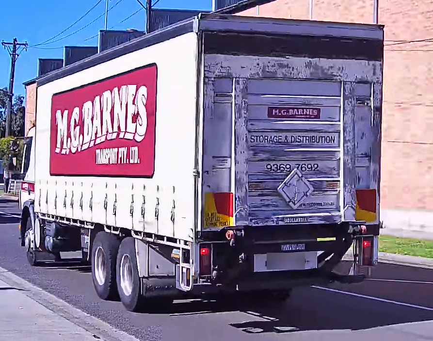

# CaB-ReID: Cab-and-Body Prompt-Guided Truck Re-Identification

CaB-ReID is a truck re-identification method that models the cab and body as complementary identity cues. TRC-31K is the image-level truck Re-ID benchmark used for its training and evaluation protocol.

**TRC-31K will be released once the paper is accepted.** This repository provides the CaB-ReID implementation and instructions for evaluating the final paper checkpoints with CLIP-ReID and TransReID backbones.

**[Download evaluation checkpoints](https://github.com/Air000/CaB-ReID/releases/tag/checkpoints)**. See [checkpoint setup](#3-prepare-and-verify-the-checkpoints) for the shared files required by both backbones.

## Why truck Re-ID?

Truck re-identification matches the same vehicle across non-overlapping cameras. It is difficult because viewpoint, scale, illumination, occlusion, articulated body configuration, and loading-state changes can substantially alter a truck's appearance. CaB-ReID addresses this by using prompt-guided cab and body regions, region-aware pooling, fused retrieval descriptors, and separate CabMem/BodyMem identity memories.

## TRC-31K dataset examples

| Box truck | Curtainside truck | Concrete truck |
|---|---|---|
|  |  |  |

## Resources

| Resource | Purpose | Location | Status |
|---|---|---|---|
| TRC-31K | Train/query/gallery benchmark | Separate dataset archive | Release after paper acceptance |
| MV-TI | Single-view combined-gallery benchmark | [Official dataset page](https://github.com/maybeextra/DAG-UMB) | Public dataset |
| CaB-ReID | Portable method with unified backbone CLI | This repository | Source code |
| Evaluation checkpoints | Final paper models on both datasets | [GitHub release assets](https://github.com/Air000/CaB-ReID/releases/tag/checkpoints) | Available as a pre-release |

TRC-31K will be distributed after paper acceptance.

## Dataset splits

| Split | Images | Identities |
|---|---:|---:|
| Train | 25,941 | 1,073 |
| Query | 2,292 | 232 |
| Gallery | 3,386 | 232 |
| **Total** | **31,619** | **1,305** |

## Final checkpoint results

The following results use the final full-training checkpoints. All metrics are percentages; reranking is disabled.

| Dataset | Backbone | Checkpoint in `weights/` | mAP | Rank-1 | Rank-5 | Rank-10 |
|---|---|---|---:|---:|---:|---:|
| MV-TI | CLIP-ReID + CaB-ReID | `cabreid_clipreid_mvti.pth` | 89.3 | 94.6 | 96.8 | 97.6 |
| MV-TI | TransReID + CaB-ReID | `cabreid_transreid_mvti.pth` | 92.6 | 96.1 | 97.2 | 97.6 |
| TRC-31K | CLIP-ReID + CaB-ReID | `cabreid_clipreid_trc31k.pth` | 87.0 | 94.5 | 97.6 | 98.9 |
| TRC-31K | TransReID + CaB-ReID | `cabreid_transreid_trc31k.pth` | 87.2 | 94.5 | 97.1 | 98.6 |

## Repo layout

```text
CaB-ReID/
├── assets/                # project-page images
├── cabreid/               # portable method modules
├── clipreid/              # CLIP-ReID backbone adapter and native trainer
├── transreid/             # TransReID backbone adapter and native trainer
├── weights/
├── main.py                # unified CLI
├── requirements.txt
└── CHECKSUMS.sha256
```

## Checkpoint evaluation

### 1. Set up the environment

Use a CUDA GPU. In Colab, select a GPU runtime before running the commands below; its PyTorch and torchvision installation can be used directly.

```bash
git clone https://github.com/Air000/CaB-ReID.git
cd CaB-ReID
python -m pip install -r requirements.txt
python -c "import torch; assert torch.cuda.is_available(), 'Select a GPU runtime'"
```

For a separate machine, use Python 3.10 or newer and install CUDA-enabled PyTorch and matching torchvision first. Run every command below from the repository root.

### 2. Prepare the dataset

**MV-TI:** obtain the dataset from its [official project page](https://github.com/maybeextra/DAG-UMB). Use the original split-name lists and the individual front, side, and back images:

```text
../dataset/MV-TI/
├── train_names.txt
├── query_names.txt
├── gallery_names.txt
├── front/{train,query,gallery}/
├── side/{train,query,gallery}/
└── back/{train,query,gallery}/
```

Each listed sample expands in Front/Side/Back order to three images named `<sample>_F.jpg`, `<sample>_S.jpg`, and `<sample>_B.jpg`. The paper evaluates the individual views in one combined gallery, not the concatenated FS/FB/SB/FSB images. 

**TRC-31K:** the dataset will be released once the paper is accepted. The commands below are for use after that release:

```text
../dataset/TRC-31K/
├── train/
├── query/
├── gallery/
└── metadata/{train,query,gallery}.csv
```

```bash
python tools/validate_release.py ../dataset/TRC-31K
```

### 3. Prepare and verify the checkpoints

Download the chosen dataset/backbone checkpoint into `weights/`. Every model also requires the shared region encoder and the small prompt-region adapter in that folder. Keep the checksum manifest there for verification. The other three model checkpoints are optional.

| Download | Purpose | Size |
|---|---|---:|
| [cabreid_clipreid_mvti.pth](https://github.com/Air000/CaB-ReID/releases/download/checkpoints/cabreid_clipreid_mvti.pth) | CLIP-ReID + CaB-ReID on MV-TI | 347 MB |
| [cabreid_transreid_mvti.pth](https://github.com/Air000/CaB-ReID/releases/download/checkpoints/cabreid_transreid_mvti.pth) | TransReID + CaB-ReID on MV-TI | 405 MB |
| [cabreid_clipreid_trc31k.pth](https://github.com/Air000/CaB-ReID/releases/download/checkpoints/cabreid_clipreid_trc31k.pth) | CLIP-ReID + CaB-ReID on TRC-31K | 348 MB |
| [cabreid_transreid_trc31k.pth](https://github.com/Air000/CaB-ReID/releases/download/checkpoints/cabreid_transreid_trc31k.pth) | TransReID + CaB-ReID on TRC-31K | 406 MB |
| [cabreid_region_encoder.pth](https://github.com/Air000/CaB-ReID/releases/download/checkpoints/cabreid_region_encoder.pth) | Shared encoder; required by every model | 344 MB |
| [clip_region_adapter.pt](https://github.com/Air000/CaB-ReID/releases/download/checkpoints/clip_region_adapter.pt) | Shared adapter; required by every model | 1 MB |
| [CHECKSUMS.sha256](https://github.com/Air000/CaB-ReID/releases/download/checkpoints/CHECKSUMS.sha256) | SHA-256 verification manifest | <1 KB |

```bash
python tools/verify_checkpoints.py --dataset mvti
# Or, for the two TRC-31K checkpoints:
python tools/verify_checkpoints.py --dataset trc31k
# If you downloaded only one backbone, also add --backbone clipreid or --backbone transreid.
```

Evaluation constructs the visual models locally and loads the supplied weights. No CLIP or ImageNet pretrained-weight download is needed, and no retraining is required. Keep `cabreid_region_encoder.pth` beside the selected checkpoint, even if you move the weights to another directory.

### 4. Evaluate

For MV-TI:

```bash
python main.py evaluate --backbone clipreid --dataset mvti \
  --data-root ../dataset/MV-TI \
  --weight weights/cabreid_clipreid_mvti.pth

python main.py evaluate --backbone transreid --dataset mvti \
  --data-root ../dataset/MV-TI \
  --weight weights/cabreid_transreid_mvti.pth
```

For TRC-31K, once the dataset is available:

```bash
python main.py evaluate --backbone clipreid --dataset trc31k \
  --data-root ../dataset/TRC-31K \
  --weight weights/cabreid_clipreid_trc31k.pth

python main.py evaluate --backbone transreid --dataset trc31k \
  --data-root ../dataset/TRC-31K \
  --weight weights/cabreid_transreid_trc31k.pth
```

Evaluation prints mAP and CMC Rank-1/5/10 and saves `test_log.txt` under `outputs/clipreid_mvti/`, `outputs/transreid_mvti/`, `outputs/clipreid/`, or `outputs/transreid/`. Gallery images sharing both identity and camera with the query are excluded.

For a smaller GPU, append `-- TEST.IMS_PER_BATCH 16`. To inspect a command without loading data or models, add `--dry-run`.

## Training

For TransReID training only, download the ImageNet-pretrained ViT-B/16 weights:

```bash
wget -O weights/jx_vit_base_p16_224-80ecf9dd.pth \
  https://github.com/rwightman/pytorch-image-models/releases/download/v0.1-vitjx/jx_vit_base_p16_224-80ecf9dd.pth
```

```bash
python main.py train --backbone clipreid --dataset mvti --data-root ../dataset/MV-TI
python main.py train --backbone transreid --dataset mvti --data-root ../dataset/MV-TI
```

For TRC-31K, use `--dataset trc31k --data-root ../dataset/TRC-31K` after obtaining access. 

